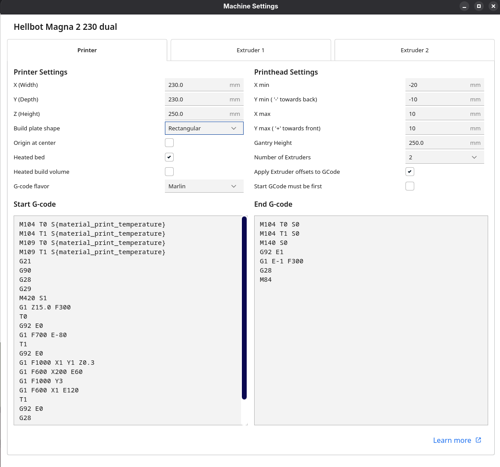
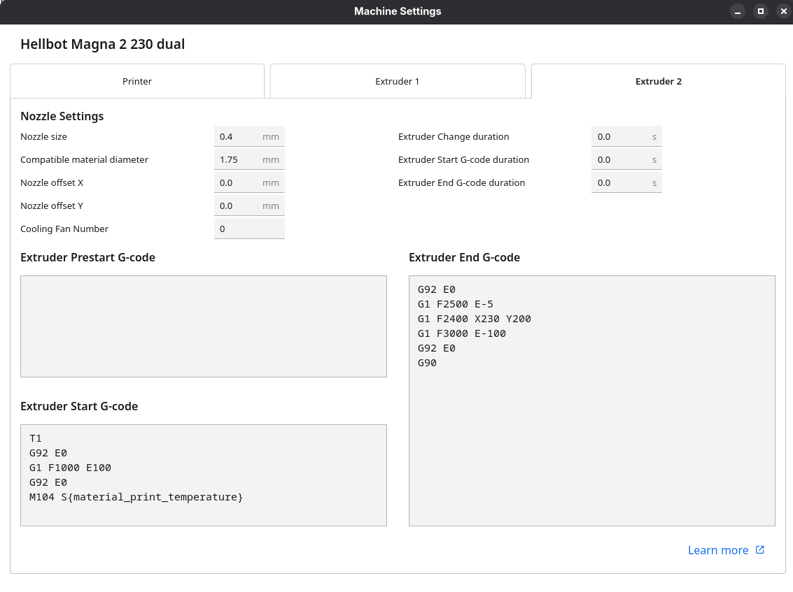

# Hellbot Magna 2 230 dual

## Settings with BL Touch





### Start G-code

```gcode
M104 T0 S{material_print_temperature}
M104 T1 S{material_print_temperature}
M109 T0 S{material_print_temperature}
M109 T1 S{material_print_temperature}
G21
G90
G28
G29
M420 S1
G1 Z15.0 F300
T0
G92 E0
G1 F700 E-80
T1
G92 E0
G1 F1000 X1 Y1 Z0.3
G1 F600 X200 E60
G1 F1000 Y3
G1 F600 X1 E120
T1
G92 E0
G28
G1 F700 E-80
T0
G92 E0
```

### End G-code

```gcode
M104 T0 S0
M104 T1 S0
M140 S0
G92 E1
G1 E-1 F300
G28
M84
```

### Extruder 1 Start G-code

```gcode
T0 
G92 E0 
G1 F1000 E100 
G92 E0 
M104 S{material_print_temperature}
```

### Extruder 1 End G-code

```gcode
G92 E0 
G1 F2500 E-5 
G1 F2400 X230 Y200 
G1 F3000 E-100 
G92 E0 
G90
```

### Extruder 2 Start G-code

```gcode
T1 
G92 E0 
G1 F1000 E100 
G92 E0 
M104 S{material_print_temperature}
```

### Extruder 2 End G-code

```gcode
G92 E0 
G1 F2500 E-5 
G1 F2400 X230 Y200 
G1 F3000 E-100 
G92 E0 
G90
```


## Original settings

### Start G-code

```gcode
M104 T0 S{material_print_temperature}
M104 T1 S{material_print_temperature}
M109 T0 S{material_print_temperature}
M109 T1 S{material_print_temperature}
G21
G90 
G28 X0 Y0 
G28 Z0 
G1 Z15.0 F300 
T0 
G92 E0 
G1 F700 E-80 
T1 
G92 E0 
G1 F1000 X1 Y1 Z0.3 
G1 F600 X200 E60 
G1 F1000 Y3 
G1 F600 X1 E120 
T1 
G92 E0 
G28 X0 Y0 
G1 F700 E-80 
T0 
G92 E0
```

### End G-code

```gcode
M104 T0 S0
M104 T1 S0
M140 S0
G92 E1
G1 E-1 F300
G28 X0 Y0
M84
```

### Extruder 1 Start G-code

```gcode
T0 
G92 E0 
G1 F1000 E100 
G92 E0 
M104 S{material_print_temperature}
```

### Extruder 1 End G-code

```gcode
G92 E0 
G1 F2500 E-5 
G1 F2400 X230 Y200 
G1 F3000 E-100 
G92 E0 
G90
```

### Extruder 2 Start G-code

```gcode
T1 
G92 E0 
G1 F1000 E100 
G92 E0 
M104 S{material_print_temperature}
```

### Extruder 2 End G-code

```gcode
G92 E0 
G1 F2500 E-5 
G1 F2400 X230 Y200 
G1 F3000 E-100 
G92 E0 
G90
```
